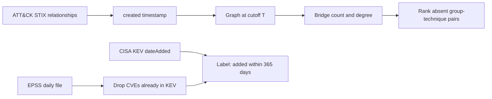

# Architecture

```mermaid
flowchart LR
  A[ATT&CK STIX relationships] --> B[created timestamp]
  B --> C[Graph at cutoff T]
  C --> D[Bridge count and degree]
  D --> E[Rank absent group-technique pairs]
  F[EPSS daily file] --> H[Drop CVEs already in KEV]
  G[CISA KEV dateAdded] --> I[Label: added within 365 days]
  H --> I
```

The score is a bridge count plus a time-decayed technique degree. Coefficients are selected on the previous year. The test horizon is not used.
